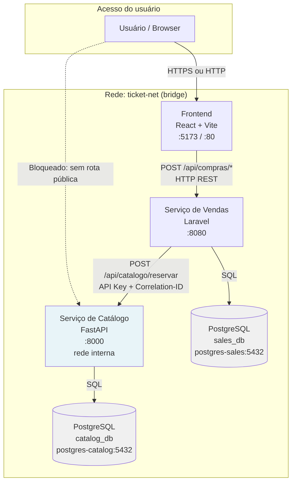

# Arquitetura geral

```mermaid
flowchart TB
    subgraph Internet["Acesso do usuário"]
        U[Usuário / Browser]
    end

    subgraph DockerNetwork["Rede: ticket-net (bridge)"]
        FE[Frontend<br/>React + Vite<br/>:5173 / :80]
        VS[Serviço de Vendas<br/>Laravel<br/>:8080]
        CS[Serviço de Catálogo<br/>FastAPI<br/>:8000<br/>rede interna]
        PG_S[(PostgreSQL<br/>sales_db<br/>postgres-sales:5432)]
        PG_C[(PostgreSQL<br/>catalog_db<br/>postgres-catalog:5432)]
    end

    U -->|HTTPS ou HTTP| FE
    FE -->|POST /api/compras/*<br/>HTTP REST| VS
    VS -->|POST /api/catalogo/reservar<br/>API Key + Correlation-ID| CS
    VS -->|SQL| PG_S
    CS -->|SQL| PG_C

    U -.->|Bloqueado: sem rota pública| CS

    style CS fill:#e8f4f8
    style PG_C fill:#f0f0f0
    style PG_S fill:#f0f0f0
```
