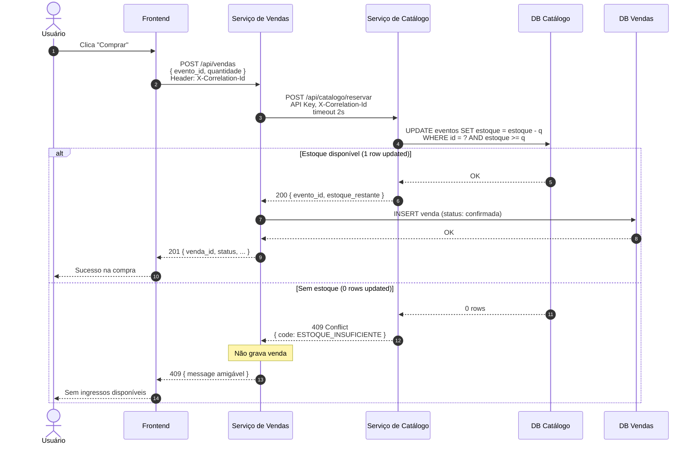

# Fluxo de compra (sequence)

Referência **sem** pagamento simulado (reserva + venda na mesma requisição). O lab implementa [12-fluxo-pagamento-simulado.md](./12-fluxo-pagamento-simulado.md).

```mermaid
sequenceDiagram
    autonumber
    actor User as Usuário
    participant FE as Frontend
    participant VS as Serviço de Vendas
    participant CS as Serviço de Catálogo
    participant DBC as DB Catálogo
    participant DBS as DB Vendas

    User->>FE: Clica "Comprar"
    FE->>VS: POST /api/vendas<br/>{ evento_id, quantidade }<br/>Header: X-Correlation-Id
    VS->>CS: POST /api/catalogo/reservar<br/>API Key, X-Correlation-Id<br/>timeout 2s
    CS->>DBC: UPDATE eventos SET estoque = estoque - q<br/>WHERE id = ? AND estoque >= q
    alt Estoque disponível (1 row updated)
        DBC-->>CS: OK
        CS-->>VS: 200 { evento_id, estoque_restante }
        VS->>DBS: INSERT venda (status: confirmada)
        DBS-->>VS: OK
        VS-->>FE: 201 { venda_id, status, ... }
        FE-->>User: Sucesso na compra
    else Sem estoque (0 rows updated)
        DBC-->>CS: 0 rows
        CS-->>VS: 409 Conflict<br/>{ code: ESTOQUE_INSUFICIENTE }
        Note over VS: Não grava venda
        VS-->>FE: 409 { message amigável }
        FE-->>User: Sem ingressos disponíveis
    end
```
