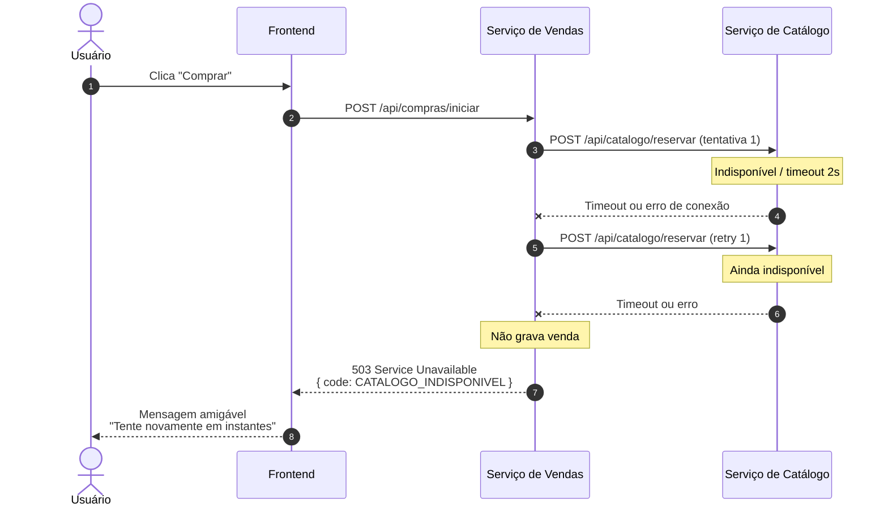

# Fluxo de falha - Catálogo indisponível

```mermaid
sequenceDiagram
    autonumber
    actor User as Usuário
    participant FE as Frontend
    participant VS as Serviço de Vendas
    participant CS as Serviço de Catálogo

    User->>FE: Clica "Comprar"
    FE->>VS: POST /api/compras/iniciar
    VS->>CS: POST /api/catalogo/reservar (tentativa 1)
    Note over CS: Indisponível / timeout 2s
    CS--xVS: Timeout ou erro de conexão
    VS->>CS: POST /api/catalogo/reservar (retry 1)
    Note over CS: Ainda indisponível
    CS--xVS: Timeout ou erro
    Note over VS: Não grava venda
    VS-->>FE: 503 Service Unavailable<br/>{ code: CATALOGO_INDISPONIVEL }
    FE-->>User: Mensagem amigável<br/>"Tente novamente em instantes"
```
