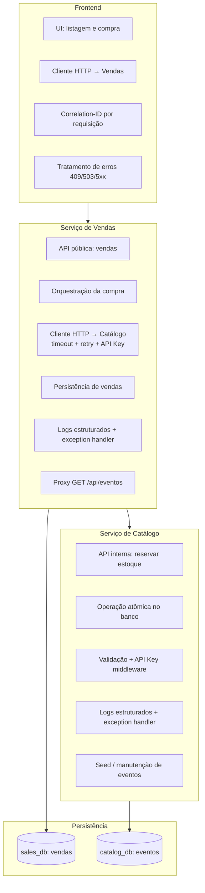

# Componentes e responsabilidades

| Componente | Responsabilidades |
|------------|-------------------|
| **Frontend** | Exibir eventos; iniciar compra; propagar `X-Correlation-Id`; mapear HTTP para UX; não conhecer Catálogo |
| **Vendas** | Único backend exposto ao browser; validar payload; chamar reserva; gravar venda só após 200 do Catálogo |
| **Catálogo** | Fonte da verdade do estoque; reserva atômica; 409 se insuficiente |
| **DB Vendas** | Registro de vendas confirmadas |
| **DB Catálogo** | Eventos e quantidade em estoque |
