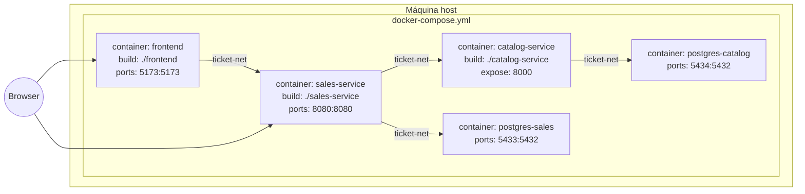

# Implantação - Docker Compose (estudo local)

```mermaid
flowchart LR
    subgraph Host["Máquina host"]
        subgraph Compose["docker-compose.yml"]
            FE_C[container: frontend<br/>build: ./frontend<br/>ports: 5173:5173]
            VS_C[container: sales-service<br/>build: ./sales-service<br/>ports: 8080:8080]
            CS_C[container: catalog-service<br/>build: ./catalog-service<br/>expose: 8000]
            PG_S_C[container: postgres-sales<br/>ports: 5433:5432]
            PG_C_C[container: postgres-catalog<br/>ports: 5434:5432]
        end
    end

    FE_C -->|ticket-net| VS_C
    VS_C -->|ticket-net| CS_C
    VS_C -->|ticket-net| PG_S_C
    CS_C -->|ticket-net| PG_C_C

    Browser((Browser)) --> FE_C
    Browser --> VS_C
```
