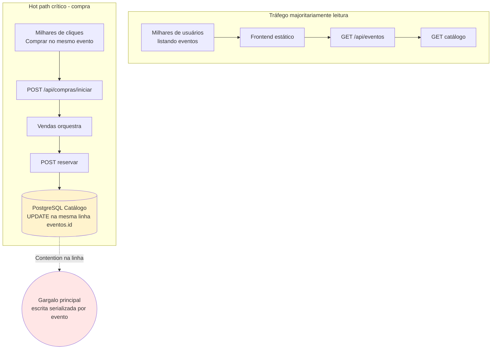

# Análise de gargalos sob alta demanda

Cenário: pico de compras no **mesmo evento** (hot row no PostgreSQL).

| Camada | Tipo de carga | Sensibilidade ao pico |
|--------|---------------|------------------------|
| Frontend (assets) | Leitura estática | Baixa - escala com CDN |
| Vendas | CPU + conexões HTTP outbound | Média - escala horizontal |
| Catálogo (reserva) | CPU + **1 UPDATE/ compra** | **Alta** |
| PostgreSQL Catálogo | Lock/row update no `evento_id` | **Muito alta** |
| PostgreSQL Vendas | INSERT por compra confirmada | Média |
