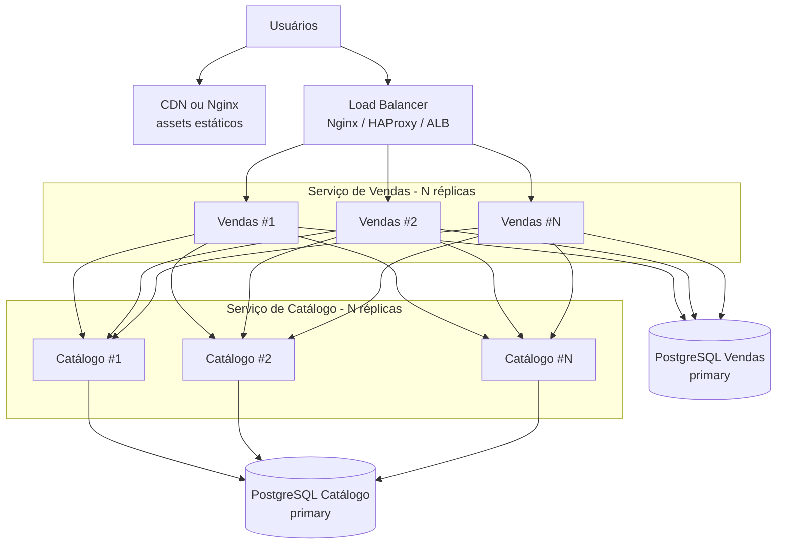

# Evolução Nível 1 - Escala horizontal (stateless)

**Objetivo:** absorver mais requisições HTTP sem alterar o contrato REST síncrono da compra.

| Onde | Técnica | Efeito |
|------|---------|--------|
| Frontend | Build estático + **CDN** (CloudFront, Cloudflare) | Reduz hit no origin; HTML/JS/CSS no edge |
| Vendas | **Load balancer** + múltiplos containers/pods | Mais requisições paralelas; serviço stateless |
| Catálogo | **Load balancer** + múltiplas instâncias | Mais workers Uvicorn; ainda compartilham **um** primary DB |
| Bancos | Connection pool por instância | Evita esgotar `max_connections` - ver Nível 3 (PgBouncer) |

**Limite deste nível:** réplicas do Catálogo aumentam capacidade de **aceitar** HTTP, mas todas convergem no **mesmo row UPDATE** - o gargalo de escrita permanece.
