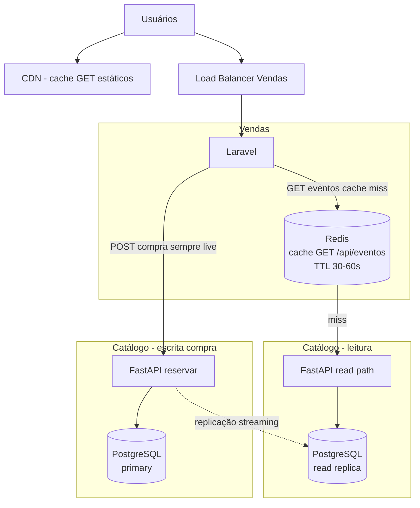

# Evolução Nível 2 - Cache e read replicas (leituras)

**Objetivo:** tirar pressão de listagens; **nunca** cachear decisão de compra.

| Onde | Tecnologia | Regra |
|------|------------|-------|
| Frontend | **CDN** | Cache de assets; API continua no Vendas |
| Vendas | **Redis** (ou cache HTTP) | Só `GET /api/eventos`; TTL curto; invalidação por TTL |
| Catálogo | **Read replica** PostgreSQL | `GET /eventos` na réplica; **`POST /reservar` no primary** |
| Compra | Sem cache | Sempre hit no primary via reserva atômica |

**Consistência:** usuário pode ver estoque ligeiramente desatualizado na listagem; no clique em Comprar, a verdade é o **409/200** da reserva.
