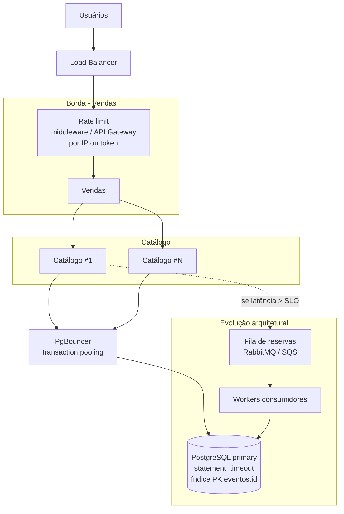
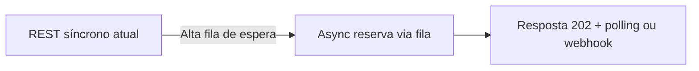

# Evolução Nível 3 - Proteção do gargalo de escrita (Catálogo)

**Objetivo:** maximizar reservas/segundo no primary e proteger o sistema de overload.

| **Onde**              | **Tecnologia**                                                  | **Por quê**                                                      |
| --------------------- | --------------------------------------------------------------- | ---------------------------------------------------------------- |
| Vendas                | **Rate limiting** (middleware Laravel, Kong, Nginx `limit_req`) | Evita thundering herd; fila humana na UX                         |
| Vendas → Catálogo     | **Circuit breaker** (Guzzle)                                    | Falha rápida; protege Catálogo saturado                          |
| Catálogo → DB         | **PgBouncer**                                                   | Multiplexa conexões; primary não explode `max_connections`       |
| PostgreSQL            | **Primary tuning**, `statement_timeout`, fila curta             | UPDATE atômico permanece; sem oversell                           |
| Sharding (conceitual) | Particionar por `evento_id` em DBs diferentes                   | Só se um evento único exceder capacidade de **uma** instância PG |

### Opcional documentado (mudaria o modelo de estudo)

Usar fila **só** se a apresentação incluir trade-off: maior throughput vs. fluxo síncrono mais simples. O código de estudo permanece no caminho **A**.