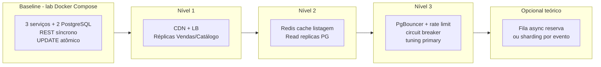
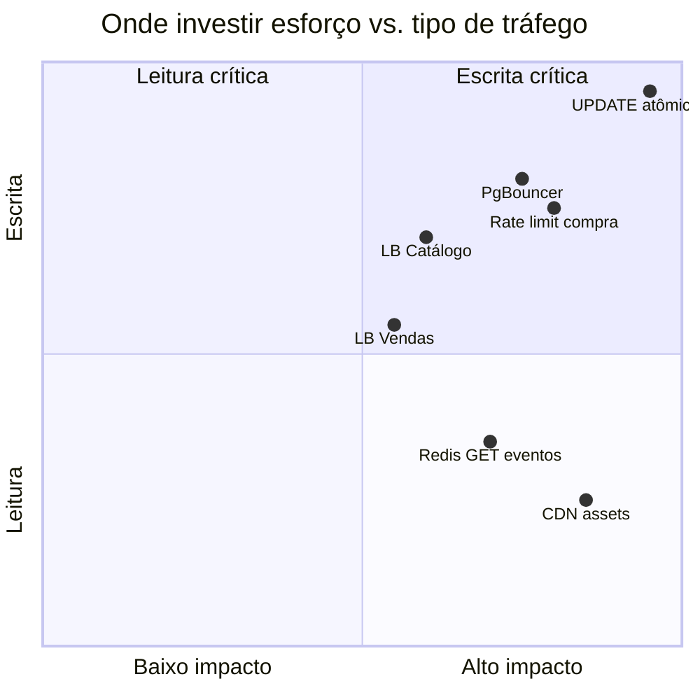

# Roadmap de evolução arquitetural (alta demanda)

Visão em estágios - **documentação para apresentação**, não roadmap de produto.

| Estágio | Problema que endereça | Mantém consistência anti-oversell? |
|---------|------------------------|-----------------------------------|
| Baseline | Aprendizado do fluxo | Sim |
| Nível 1 | Volume de conexões HTTP | Sim |
| Nível 2 | Picos em listagem | Sim (compra sempre no primary) |
| Nível 3 | Saturação DB / thundering herd | Sim |
| Opcional fila | Throughput extremo de reserva | Requer desenho de idempotência/compensação |
