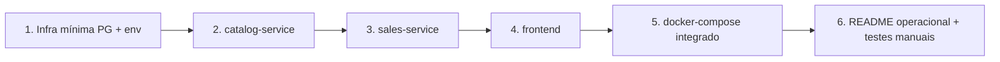

# Ordem de implementação (lab)

Sequência recomendada: de dentro para fora (Catálogo → Vendas → Frontend → Compose).

| Passo | Entrega | Teste isolado |
|-------|---------|---------------|
| 1 | `.env.example`, scripts SQL ou migrations vazias | - |
| 2 | Catálogo completo | Catálogo + PG; curl com API Key |
| 3 | Vendas completo | curl POST/GET na API Laravel |
| 4 | Frontend | Vite apontando para Vendas |
| 5 | Compose unificado | `docker compose up --build` |
| 6 | Documentação de uso | Testes manuais (planejamento §12) |
