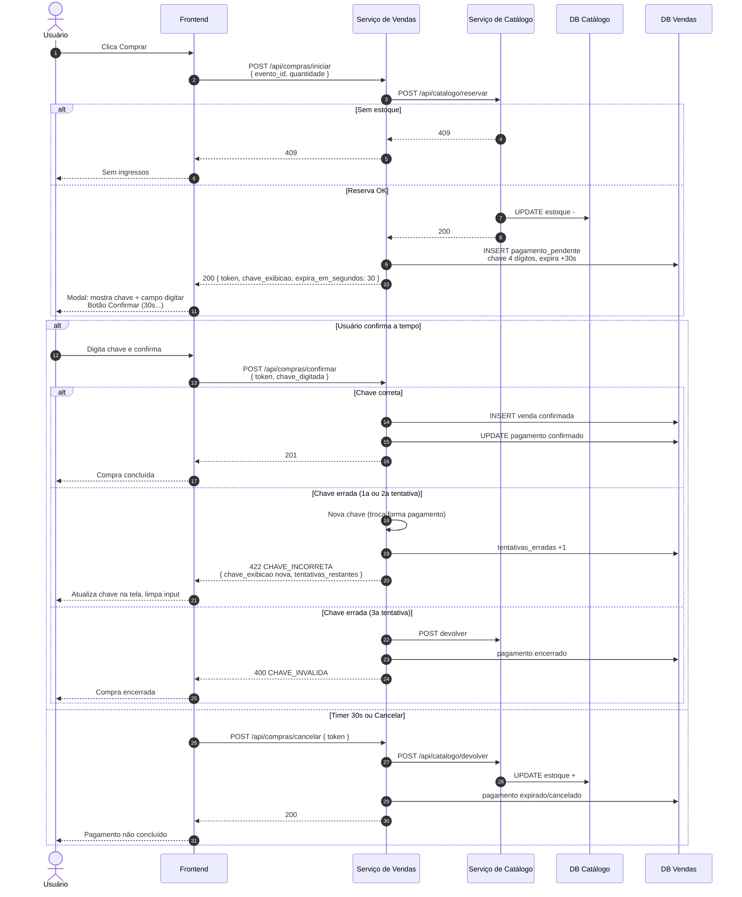

# Fluxo de compra com pagamento simulado (sequence)

Simula QR code / cartão: chave de 4 dígitos exibida na tela, usuário digita e confirma em até **30 segundos**. A **reserva** ocorre ao iniciar; a **venda** só após pagamento confirmado. Expirou ou cancelou -> **devolver** estoque.

**Regras:**

- Contador de **30s** no botão de confirmar (frontend); backend valida `expires_at` na confirmação.
- Chave errada: até **2** erros -> **422** `CHAVE_INCORRETA`, gera **nova** `chave_exibicao` (simula troca QR/cartão), corpo inclui `tentativas_restantes`.
- **3o** erro de chave -> **400** `CHAVE_INVALIDA`, **devolver** estoque, encerrar pendente (mesmo efeito de abandono).
- Confirmar após expirar: **410** `PAGAMENTO_EXPIRADO` + devolver estoque se ainda pendente.

Fluxo catálogo indisponível na reserva: igual [03-fluxo-falha-sequencia.md](./03-fluxo-falha-sequencia.md) (503, sem pendente).

O fluxo [02-fluxo-compra-sequencia.md](./02-fluxo-compra-sequencia.md) descreve apenas a fase reserva + venda imediata (referência histórica); o lab implementa **este** fluxo.
